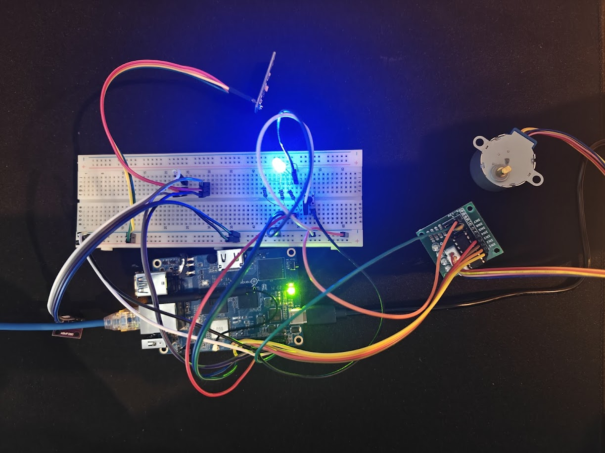
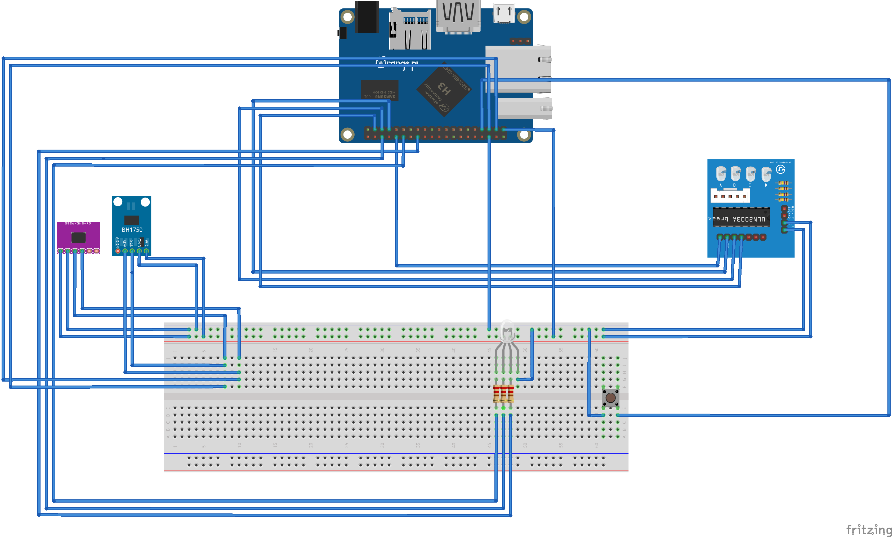

# IoT Case Study – Smart Light and Temperature Monitoring System

## 📌 Overzicht
Dit project is een IoT-oplossing die lichtintensiteit en temperatuur meet en deze gegevens doorstuurt naar **ThingSpeak**. Op basis van de gemeten lux-waarde wordt een **stappenmotor** aangestuurd die een gordijn simuleert. Daarnaast bevat het project een **RGB LED** die de temperatuur in de kamer simuleert en via een knop kan worden bediend.

## 🛠️ Hardware Componenten
- **Orange Pi 3 LTS** – Hoofdcontroller
- **GY-30 (BH1750) lichtsensor** – Meet lichtintensiteit in lux
- **BMP280 temperatuur- en druksensor** – Meet temperatuur
- **ULN2003 stappenmotor driver + stappenmotor** – Simuleert gordijnbeweging
- **RGB LED** – Indicatie van status
- **Drukknop** – Wijzigen van LED-kleur
- **Breadboard & jumper wires** – Voor bekabeling en aansluitingen

## 📸 Foto's en Schema
### Opstelling

### Blokschema

### Youtube Video

